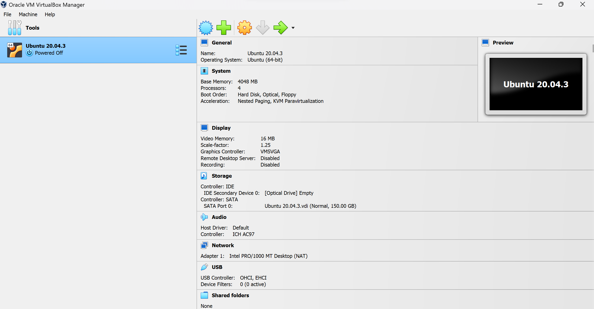
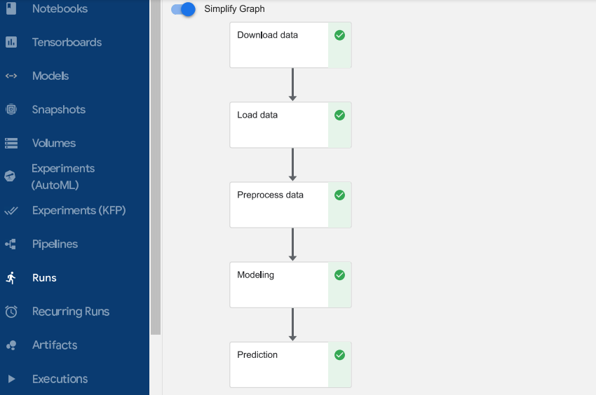

# Pneumonia-Detection-Kubeflow
Built using Kubeflow, this ML pipeline effectively detects pneumonia in medical images from Kaggle's dataset. By automating data preprocessing, model training, and evaluation, the pipeline showcases the synergy between advanced technology and healthcare.

**Architecture Diagram:**  
  

***Note: Following the given steps may incur you charges!! I have used the google cloud's free trial resources for all the provisions. If possible I encourage you to do the same!***

**Used Components:**
+ kubeflow 1.7 - Jupyter Notebook
- Google cloud storage bucket
* kubernetes 1.27
+ Google compute engine 

**Steps Involved:**
1. Create a VM instance of minimum 32gb ram and 6 core
1. Download the dataset from [Kaggle](https://www.kaggle.com/datasets/lasaljaywardena/pneumonia-chest-x-ray-dataset) and upload it to gcs bucket
1. Create a service account with storageobjectviewer permission and download the keys.json (I recommand you to follow some tutorial)
1. SSH to the VM instance and follow this [doc](https://charmed-kubeflow.io/docs/get-started-with-charmed-kubeflow) for kubeflow set up
1. Once Kubeflow is installed, go to the dashboard and Create your Jupyter Notebook (choose custom image as tensorflow-full)
1. Finally Create a ML pipeline with Kubeflow pipeline

# 1. Local Machine Setup:
You can either create your own custom keys with Puttygen or use Google Cloud CLI on your local machine to create a ssh access to the VM you just created. If you are unsure of what i mean, Please refer internet on how to setup remote access on your VM.
> I prefer using a linux os such as Ubuntu for this step

> If you are using a window's pc you can also install Oracle VM virtual box and install ubuntu 20.04 or later

***(The doc that I shared earlier requires you to have proxy access to kubeflow dashboard. So this step is mandatory!!)***

# 2. Setup Kubeflow:
Once you are connected to your VM Instance via remote. Follow the [doc](https://charmed-kubeflow.io/docs/get-started-with-charmed-kubeflow) I shared you.
> Setting the cluster up can be hard. Ensure if that system meets the requirement as it stated in the docs.

***Don't proceed any step furthur if any of the pods are inactive. Once every pod is active, you can access the kubeflow dashboard***

# 3. Setup Notebook:
Download the access-ml-pipeline.yaml file from this repository and make sure to add ur namespace inside the file. After that you can run the following code on ur VM.

`kubectl apply -f access-ml-pipeline.yaml`

Now Navigate to **Kubeflow Dashboard -> Notebook**

Create a Jupyter Notebook with custom image **tensorflow-full:1.7**

Your are free to provision the resources such as **CPU and Ram**

Scroll down click advance settings **Enable access-ml-pipeline Rule that you created**

# 4. Create Pipeline:
Connect to the Notebook you have created and Run `pip list`

Check if the packages in requirement.txt file matches the version of the one's that are pre-installed

Now you can create your own pipeline using python sdk or git clone this repository and run 

After you run the Notebook **Click on the run details**

you will see something similar like this 

If any of the components fails. Check the logs and take some action to fix it. You can refer stackoverflow regarding the issue.

***Its better to create a seperate notebook and run the code without components to check if the code really works . It will save you a lot of time troubleshooting with kubeflow incase pod fails due to misconfig***

I Ultimately wanted to integrate the pipeline to kserve for serving but i couldn't able to do it due to some reason. But it was a fun project to work on. I learnt various new things about linux, networking and kubeflow.
